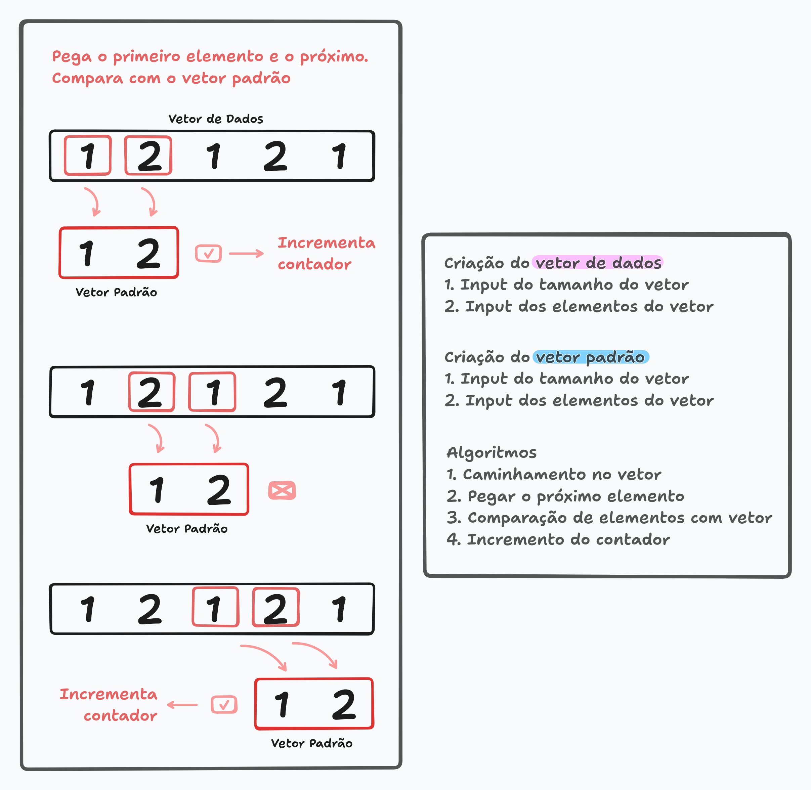

# Trabalho 2 da disciplina de Fundamentos de Sistemas Computacionais.

1. Implementar um programa em assembly do MIPS que terá por função a contagem da ocorrência de um determinado padrão dentro de uma lista de dados (vetorDados). Cada dado contido tanto na lista de dados (vetorDados), quanto na lista de dados que representam o padrão (vetorPadrao) é representado como uma palavra (i. e. word, 32 bits). O vetorDados poderá conter no máximo 50 palavras, enquanto o vetorPadrao poderá conter até 5 palavras.

2. O programa deverá permitir a definição do número de elementos do vetor de dados, os elementos deste vetor, o número de elementos do vetor de dados que representa o padrão e os elementos deste último vetor. Estes valores serão informados pelo usuário via teclado através do uso da primitiva syscall. Como saída, deve-se informar a quantidade de padrões encontrados em vetorDados. Esta informação deverá ser informada na console utilizando a primitiva syscall

[Link do Tldraw](https://www.tldraw.com/r/wtgT2kYCl3aEKA4v79Odu?d=v-1109.-329.3370.1638.page)

---

- Imagem de exemplo:

